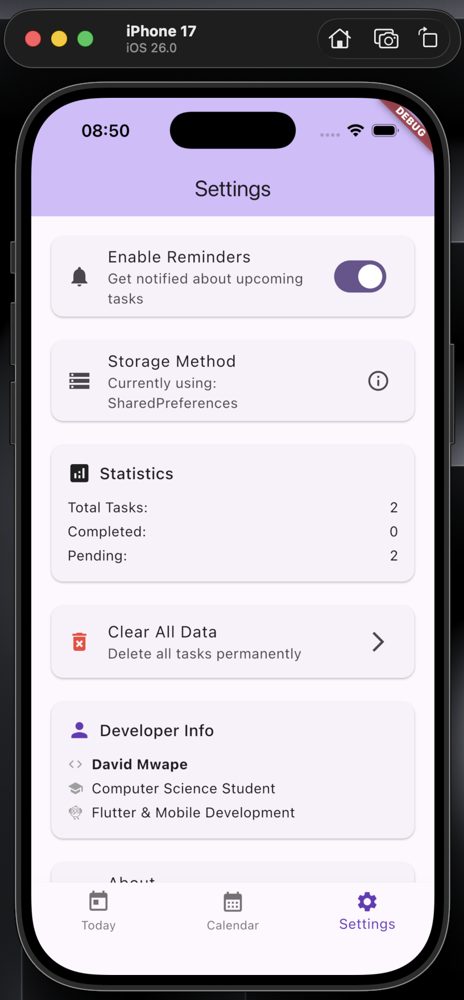

# 📚 David's Study Planner App

**Developed by David Mwape**  
*BSE | Flutter & Mobile App Developer*

A comprehensive Flutter application designed to help students manage their study tasks efficiently with calendar integration and reminder systems.

## ✨ Features

### 📋 Task Management
- Create tasks with title, description, due date, and reminder time
- View today's tasks on dedicated screen
- View tasks for any selected date
- Edit and delete tasks functionality

### 📅 Calendar Integration
- Monthly calendar view with task highlighting
- Interactive date selection
- Visual indicators for dates with tasks

### 🔔 Smart Reminder System
- Customizable reminder times for tasks
- Pop-up alert notifications
- Toggle reminders on/off in settings

### 💾 Local Data Storage
- Persistent task storage using SharedPreferences
- Data remains after app restart
- Efficient JSON-based storage

### 🎨 User Interface
- Material Design principles
- Bottom navigation with Today, Calendar, Settings screens
- Responsive design for portrait/landscape
- Clean, intuitive user experience

## 🚀 Getting Started

### Prerequisites
- Flutter SDK (^3.9.0)
- Android Studio or VS Code
- Android Emulator or Physical Device

### Installation
1. Clone the repository
2. Run `flutter pub get` to install dependencies
3. Run `flutter run` to start the app

## 📱 App Screenshots

### Today's Tasks Screen

**Flutter Widgets Used:**
- `Scaffold` - Main app structure
- `AppBar` - Top navigation bar
- `ListView.builder` - Scrollable task list
- `ListTile` - Individual task items
- `Checkbox` - Task completion status
- `Text` - Task titles and descriptions
- `FloatingActionButton` - Add new task button
- `BottomNavigationBar` - Bottom navigation

### Calendar Screen

**Flutter Widgets Used:**
- `Scaffold` - Main app structure
- `AppBar` - Top navigation with month/year
- `TableCalendar` - Monthly calendar widget
- `Container` - Date highlighting
- `ListView` - Tasks for selected date
- `Card` - Task containers
- `Text` - Date and task information
- `IconButton` - Navigation arrows

### Settings Screen

**Flutter Widgets Used:**
- `Scaffold` - Main app structure
- `AppBar` - Top navigation bar
- `ListView` - Settings list
- `ListTile` - Settings items
- `Switch` - Toggle switches
- `Text` - Labels and descriptions
- `Icon` - Setting icons
- `Divider` - Visual separators

### Add Task Screen

**Flutter Widgets Used:**
- `Scaffold` - Main app structure
- `AppBar` - Top navigation with save action
- `Form` - Form validation
- `TextFormField` - Input fields
- `DatePicker` - Date selection
- `TimePicker` - Time selection
- `ElevatedButton` - Save button
- `Padding` - Layout spacing
- `Column` - Vertical layout

### Edit Task Screen

**Flutter Widgets Used:**
- `Scaffold` - Main app structure
- `AppBar` - Top navigation with actions
- `Form` - Form validation
- `TextFormField` - Pre-filled input fields
- `DatePicker` - Date modification
- `TimePicker` - Time modification
- `ElevatedButton` - Update/Delete buttons
- `AlertDialog` - Confirmation dialogs

## 🎯 Technical Implementation

### Core Flutter Widgets Summary
- **Layout Widgets**: `Scaffold`, `AppBar`, `Column`, `Row`, `Container`, `Padding`
- **List Widgets**: `ListView`, `ListTile`, `Card`
- **Input Widgets**: `TextFormField`, `Checkbox`, `Switch`
- **Navigation**: `BottomNavigationBar`, `FloatingActionButton`
- **Pickers**: `DatePicker`, `TimePicker`
- **Calendar**: `TableCalendar` (external package)
- **Dialogs**: `AlertDialog`, `showDialog`

### Data Persistence
- **SharedPreferences** for local storage
- **JSON serialization** for task data
- **State management** with StatefulWidget

## 👨‍💻 Developer

**David Mwape**
- Computer Science Student
- Flutter & Mobile App Development
- Passionate about creating user-friendly mobile applications

---
**Developed with ❤️ by David Mwape**
